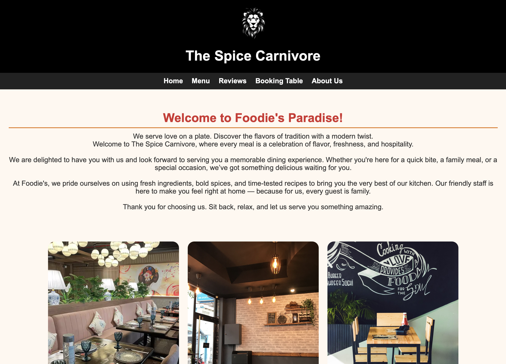
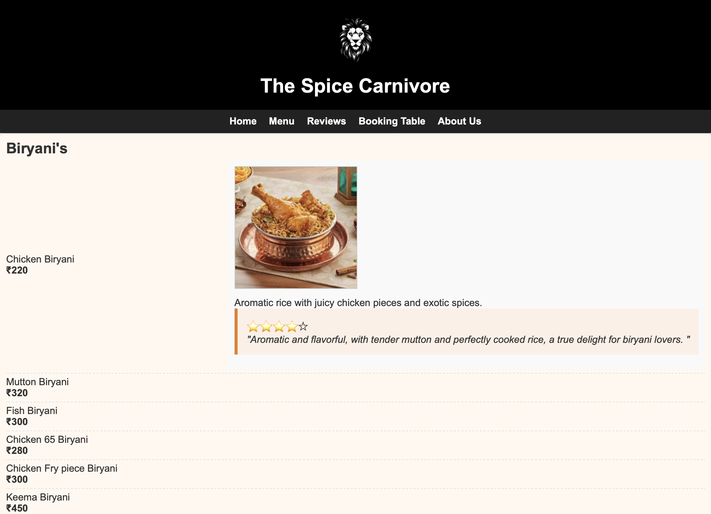
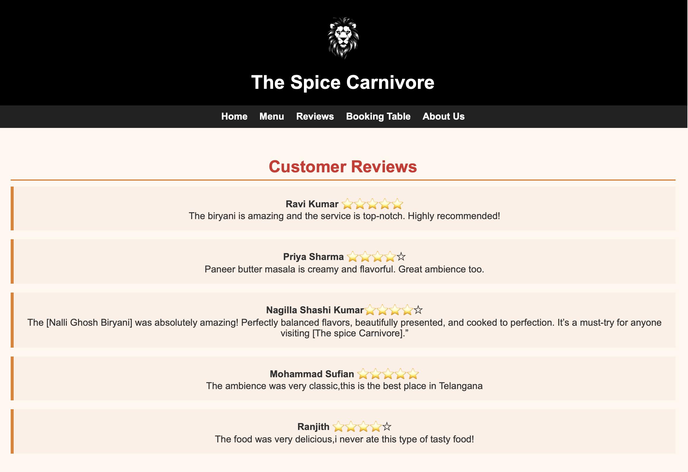
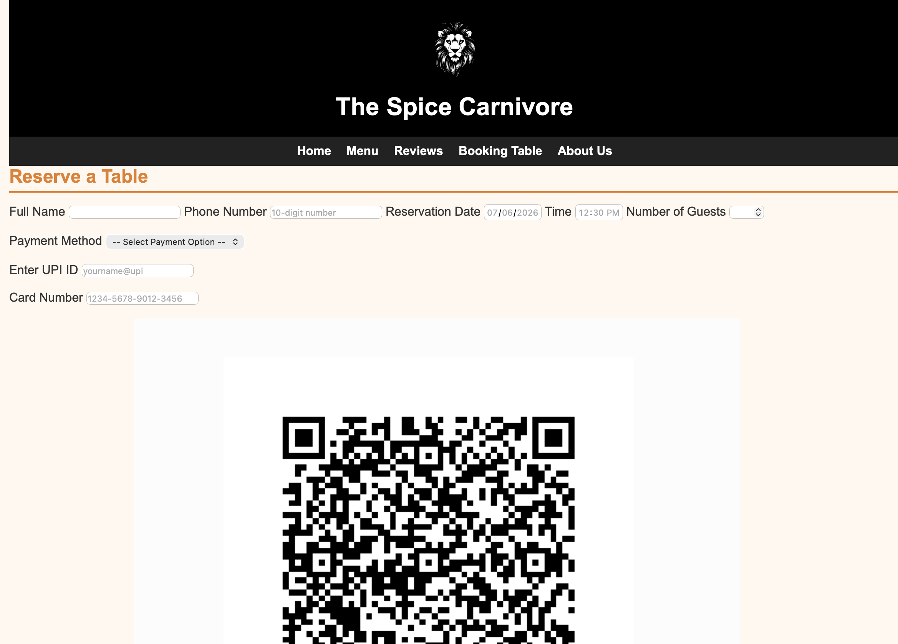
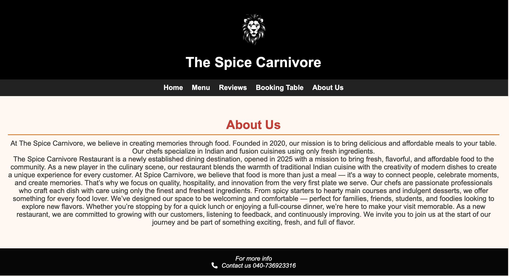

# 🍽️ The Spice Carnivore - Restaurant Website

A modern and interactive restaurant website developed using HTML, CSS, and JavaScript. The website provides customers with an engaging platform to explore the restaurant, browse the menu, read reviews, and reserve tables online.

## 📌 Project Overview

The Spice Carnivore is a multi-page restaurant website designed to deliver a seamless online dining experience. The project focuses on user-friendly navigation, responsive design, and interactive features.

---

## ✨ Features

### 🏠 Home Page
- Restaurant introduction
- Attractive food gallery
- Welcome message
- Navigation bar

### 🍛 Menu Page
- Multiple food categories
- Item descriptions
- Pricing details
- Food images
- Customer ratings
- Interactive menu expansion

### ⭐ Reviews Page
- Customer testimonials
- Star ratings
- User feedback display

### 📅 Table Reservation
- Customer information form
- Date and time selection
- Guest count
- Payment method selection
- UPI/Card payment options
- QR code payment support
- Reservation confirmation

### ℹ️ About Us
- Restaurant history
- Mission and vision
- Contact details
- Customer-focused approach

---

## 🛠️ Technologies Used

- HTML5
- CSS3
- JavaScript
- Font Awesome Icons

---

## 📸 Visual Preview

### 🏠 Home Page


### 🍽️ Menu Page


### ⭐ Customer Reviews


### 📅 Table Reservation


### ℹ️ About Us


---

## 🎥 Project Preview

The Spice Carnivore is a modern restaurant website featuring:
- 🍛 Interactive Food Menu
- 📅 Table Reservation System
- ⭐ Customer Reviews
- 💳 Multiple Payment Options
- 📱 Responsive Design
- 🎨 Attractive User Interface


## 🎯 Key Functionalities

- Responsive website design
- Interactive menu system
- Dynamic reservation form
- Payment option handling
- Hover animations
- Mobile-friendly layout

---

## 📂 Project Structure

```
The-Spice-Carnivore/
│
├── index.html
├── menu.html
├── Reservation.html
├── about.html
├── p.html
├── style.css
├── reservation.css
└── README.md
```

---

## 🚀 How to Run

1. Download or clone the repository.
2. Open the project folder.
3. Open `index.html` in your browser.
4. Explore the website features.

---

## 💡 Learning Outcomes

This project helped me strengthen my understanding of:
- Frontend web development
- HTML page structuring
- CSS styling and responsive layouts
- JavaScript DOM manipulation
- Form validation
- Interactive UI design

---

## 🔮 Future Enhancements

- User login and authentication
- Backend database integration
- Online food ordering
- Admin dashboard
- Live table availability
- Payment gateway integration
- Search and filter options
- Restaurant location map

---

## 📸 Project Highlights

✔ Responsive Design

✔ Interactive Menu

✔ Online Table Booking

✔ Customer Reviews

✔ Modern User Interface

✔ Mobile Friendly

---

## 👨‍💻 Developer

**Guruvani Rohith Kumar**

B.Tech (AI & DS)

Passionate about Web Development, AI, and Building User-Friendly Applications.

---

⭐ If you like this project, don't forget to star the repository!
